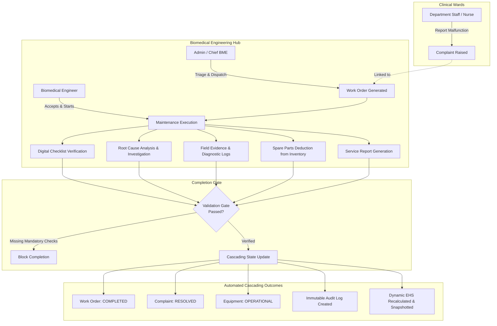

# 🏥 Medixa — Biomedical Equipment Lifecycle & Maintenance Management Platform

> **S7 Biomedical & Computer Science Engineering Capstone / Mini Project**  
> An enterprise-grade, regulatory-aligned Hospital Asset Lifecycle and Computerized Maintenance Management System (CMMS) built with **React 19, TypeScript, Express.js, and MongoDB**.

---

## 📌 Executive Summary & Project Overview

Modern healthcare delivery depends critically on the continuous availability, safety, and regulatory compliance of biomedical equipment (e.g., Ventilators, Defibrillators, Patient Monitors, MRI/CT Scanners, and Infusion Pumps). In many hospitals, equipment management suffers from:
* **Fragmented paper-based work orders** and unmonitored breakdown logging.
* **Lack of strict completion gating**, allowing unverified or improperly repaired machinery back into clinical wards.
* **Absence of predictive health modeling**, resulting in unexpected clinical breakdowns during critical patient care.
* **Disjointed spare-parts inventory and procurement**, leading to extended Mean Time To Repair (MTTR).

**Medixa** solves these clinical and operational challenges by providing an end-to-end, closed-loop platform that manages medical equipment through its entire operational lifecycle: from procurement and department commissioning, to proactive preventive maintenance, automated calibration tracking, AI/formula-driven health score evaluation, and decommissioning.

---

## 🎯 Core Problem Statement & Key Solutions

| Problem in Healthcare Operations | Medixa Technical Solution |
|---|---|
| **Premature / Unverified Equipment Release** | **Strict Completion Gating**: System forbids closing maintenance work orders unless all required checklist items pass, safety verification is confirmed, root causes are investigated, and a formal service report is generated. |
| **Unknown Device Reliability / Degradation** | **Dynamic Equipment Health Score (EHS)**: 7-component mathematical model factoring breakdown frequency, complaint severity, downtime hours, PM compliance, calibration results, service safety records, and asset aging. |
| **Siloed Communication between Nurses & Engineers** | **Real-Time Complaint & Triage Engine**: Nurses report malfunctions with severity tags; lead engineers triage, generate work orders, and assign specialized biomedical engineers. |
| **Inventory Shortages during Emergency Repairs** | **Integrated Spare-Parts & Vendor Procurement**: Automatic stock deductions on maintenance completion, reorder thresholds, and Purchase Order (PO) tracking. |
| **Accreditation & Audit Exposure (JCI / NABH)** | **Immutable Audit Trail & Compliance Checklists**: Tamper-evident logging of every status change, inspection response, and user action across the hospital. |

---

## 🏗️ System Architecture & Data Flow



---

## 🧮 Mathematical Model: Equipment Health Score (EHS)

Medixa continuously computes a composite **Equipment Health Score ($EHS \in [0, 100]$)** for every active medical device using a 7-factor weighted algorithm:

$$\text{EHS} = 0.20 \cdot B + 0.15 \cdot C + 0.15 \cdot D + 0.15 \cdot PM + 0.10 \cdot CAL + 0.10 \cdot SR + 0.15 \cdot AGE$$

### Component Breakdown & Weights:

1. **$B$ — Breakdown Frequency Score ($20\%$)**: Penalizes recurring equipment breakdowns within rolling 90-day intervals ($0 \rightarrow 100$, $1 \rightarrow 80$, $2 \rightarrow 60$, $3 \rightarrow 40$, $\ge 4 \rightarrow 20$).
2. **$C$ — Complaint Severity Score ($15\%$)**: Evaluates unresolved complaints with non-linear penalties for critical/life-support devices.
3. **$D$ — Downtime Impact Score ($15\%$)**: Quantifies total offline operational hours against standard operational uptime benchmarks.
4. **$PM$ — Preventive Maintenance Adherence ($15\%$)**: Calculates the ratio of completed scheduled PMs versus overdue services.
5. **$CAL$ — Calibration Compliance ($10\%$)**: Verifies precision measurement certifications (`PASS`: $100$, `CONDITIONAL`: $65$, `FAIL`: $10$, `OVERDUE`: $25$).
6. **$SR$ — Service Record & Safety Verification ($10\%$)**: Measures historical checklist inspection pass rates and electrical/biological safety sign-offs.
7. **$AGE$ — Asset Aging & Depreciation ($15\%$)**: Non-linear degradation curve comparing current device age against manufacturer expected operational lifespan.

### Health Classification Categories:
* 🟢 **HEALTHY ($85.0 - 100.0$)**: Optimal operational condition; standard routine PM scheduled.
* 🟡 **MONITOR ($70.0 - 84.9$)**: Minor degradation or approaching service window; increase monitoring.
* 🟠 **AT_RISK ($50.0 - 69.9$)**: Elevated complaint frequency or degraded calibration; prioritize maintenance & parts.
* 🔴 **CRITICAL ($0.0 - 49.9$)**: Safety hazard or critical failure; immediate engineering quarantine and review.

---

## 👥 Role-Based Access Control (RBAC)

Medixa implements strict role segregation:

| Role | Permissions & Scope | Typical Users |
|---|---|---|
| **ADMINISTRATOR** | System-wide configuration, department management, user administration, checklist authoring, work order assignment, procurement approvals, governance audits, and executive analytics. | Chief Biomedical Director, Hospital Operations Manager |
| **BIOMEDICAL_ENGINEER** | Access to assigned work orders, checklist execution, failure investigation/RCA, spare part logging, service report authoring, calibration execution, and maintenance completion. | Clinical Engineers, Biomedical Techs, Calibration Specialists |
| **DEPARTMENT_STAFF** | Department-scoped equipment directory, real-time complaint logging, status tracking, service history viewing, and handover sign-offs. | ICU Head Nurses, Surgical Technicians, Ward In-Charges |

---

## 📦 Key Functional Modules

### 1. Equipment & Asset Management
* Centralized asset registry with unique identifiers (e.g., `EQ-ICU-001`, `EQ-RAD-004`).
* Complete lifecycle stages: `PROCUREMENT` $\rightarrow$ `RECEIVED` $\rightarrow$ `INVENTORY` $\rightarrow$ `ASSIGNED` $\rightarrow$ `IN_SERVICE` $\rightarrow$ `MAINTENANCE` $\rightarrow$ `CALIBRATION` $\rightarrow$ `RETIRED` $\rightarrow$ `DISPOSED`.
* Department association, room/bay tracking, manufacturer, serial number, and live status.

### 2. Complaints & Triage
* Incident reporting with severity categorization (`LOW`, `MEDIUM`, `HIGH`, `CRITICAL`).
* Real-time triage workflow: transitions from `OPEN` $\rightarrow$ `TRIAGED` $\rightarrow$ `ASSIGNED` $\rightarrow$ `IN_PROGRESS` $\rightarrow$ `RESOLVED` $\rightarrow$ `CLOSED`.
* Communication thread between ward staff and engineers.

### 3. Work Order & Maintenance Management
* Automated and manual work order generation (`PREVENTIVE`, `CORRECTIVE`, `CALIBRATION`, `EMERGENCY`).
* Scheduled vs. actual maintenance time tracking for MTBF and MTTR metrics.
* Mobile-responsive engineering console for field technicians.

### 4. Safety Checklists & Investigations
* Configurable digital inspection checklists tailored to equipment category (e.g., Ventilator checklist, Defibrillator energy discharge checklist).
* Mandatory Root Cause Analysis (RCA) and contributing factor recording when components fail.
* Photo/PDF attachment evidence upload.

### 5. Preventive Maintenance & Calibration
* Dynamic scheduling engine calculating next due dates based on vendor protocols.
* NIST / ISO-traceable calibration record tracking with pass/fail tolerances and certificate uploads.

### 6. Spare Parts Inventory & Purchase Orders
* Catalog of medical-grade replacement components (valves, battery packs, sensor arrays, filters).
* Automated stock movements and threshold warnings.
* Vendor relationship management with Purchase Order tracking (`DRAFT`, `ISSUED`, `PARTIAL`, `FULFILLED`).

### 7. Warranty & AMC Tracking
* OEM warranty and Annual Maintenance Contract (AMC) tracking.
* Dynamic days-to-expiry calculation with proactive renewal notifications.

### 8. Analytics, Reports & Audit Trail
* Interactive executive dashboards powered by Recharts.
* Department health score rankings, breakdown Pareto charts, and maintenance cost metrics.
* Tamper-evident, queryable audit log trail (`AuditLog`) for regulatory accreditation (NABH / JCI / FDA compliance).

---

## 💻 Tech Stack

### Frontend
* **Framework**: React 19 + TypeScript
* **Routing & Meta-framework**: TanStack Start & TanStack Router
* **Build Tool**: Vite
* **Styling**: Tailwind CSS + Radix UI Primitives
* **Data Fetching & State**: TanStack Query (React Query) + Axios
* **Icons & Visuals**: Lucide React + Recharts

### Backend
* **Runtime**: Node.js (ES Modules)
* **Framework**: Express.js
* **Database**: MongoDB with Mongoose ODM
* **Authentication**: JWT (JSON Web Tokens) with HTTP-only cookies / Authorization headers
* **Password Security**: Bcrypt.js
* **File Uploads**: Multer (configured for local evidence storage)
* **API Security**: Helmet, dynamic CORS whitelist

---

## 📂 Project Directory Structure

```
S7_miniproject_hlaf/
├── backend/
│   ├── config/             # Database connection & server configurations
│   ├── controllers/        # REST endpoint controllers (20+ controllers)
│   ├── middleware/         # Auth, RBAC, error handling & upload middlewares
│   ├── models/             # Mongoose schemas (Equipment, WorkOrder, Maintenance, etc.)
│   ├── routes/             # Express API route declarations
│   ├── scripts/            # Database migration and utility scripts
│   ├── seed/               # Idempotent demo database seeder (seed.js)
│   ├── services/           # Business logic (EHS calculation, lifecycle engine, audits)
│   ├── server.js           # API entry point
│   └── package.json
│
├── frontend/
│   ├── src/
│   │   ├── components/     # UI components, layouts, modals, data tables
│   │   ├── hooks/          # Custom React hooks (auth, notifications, query)
│   │   ├── lib/            # Axios API client, utils, formatters
│   │   ├── routes/         # TanStack file-based routes (dashboard, complaints, etc.)
│   │   └── styles.css      # Design system & Tailwind styling
│   ├── public/             # Static public assets
│   ├── vite.config.ts      # Vite configuration
│   └── package.json
│
├── uploads/                # Local storage for maintenance evidence & reports
└── README.md               # Master project documentation
```

---

## 🚀 Getting Started Locally

### Prerequisites
* **Node.js** (v18 or higher)
* **MongoDB** (Local MongoDB instance or MongoDB Atlas URI)
* **npm** or **bun**

---

### Step 1: Backend Setup

```bash
# Navigate to the backend directory
cd backend

# Create environment file
cp .env.example .env
```

Configure your `backend/.env` file:
```ini
PORT=5000
MONGODB_URI=mongodb://127.0.0.1:27017/hospital_equipment
JWT_SECRET=super_secret_jwt_key_for_medixa_platform
JWT_EXPIRES_IN=7d
CLIENT_URL=http://localhost:5173,http://localhost:3000
UPLOAD_DIR=../uploads
```

Install dependencies and seed the database with realistic hospital data:
```bash
# Install backend dependencies
npm install

# Seed the database (creates departments, users, equipment, maintenance logs)
npm run seed

# Start the backend development server
npm run dev
```
The API server will run at: **`http://localhost:5000`**

---

### Step 2: Frontend Setup

```bash
# In a new terminal, navigate to the frontend directory
cd frontend

# Install frontend dependencies
npm install
# or if you use bun:
# bun install

# Start the frontend development server
npm run dev
```
The application will be accessible at: **`http://localhost:5173`**

---

## 🔑 Demo Login Credentials

The database seeder initializes 12 pre-configured users across all 3 roles. All demo accounts use the standard password:

> **Password for all demo accounts**: `Medixa#2026`

| Role | Name | Email | Purpose / View |
|---|---|---|---|
| **Administrator** | Emilia Greene | `emilia.greene@medixa.health` | Full administrative control, all hospital stats, approvals |
| **Administrator** | Marcus Brody | `marcus.brody@medixa.health` | Operations management, inventory & PO approvals |
| **Biomedical Engineer** | Daniel Okafor | `daniel.okafor@medixa.health` | Lead engineer, assigned work orders, checklist execution |
| **Department Staff** | Clara Whitfield | `clara.whitfield@medixa.health` | ICU Head Nurse, complaint reporting & ward status view |

---

## 🌐 API Route Highlights

| Method | Endpoint | Description | Access |
|---|---|---|---|
| `POST` | `/api/auth/login` | Authenticate user & issue JWT | Public |
| `GET` | `/api/equipment` | Filterable list of all hospital equipment | All Authenticated |
| `GET` | `/api/equipment/:id/health` | Real-time dynamic EHS calculation | All Authenticated |
| `POST` | `/api/complaints` | File a new equipment complaint | Dept Staff / Admin |
| `POST` | `/api/work-orders` | Generate maintenance work order | Admin / BME Lead |
| `POST` | `/api/maintenance/:id/checklist` | Submit inspection checklist answers | Assigned BME |
| `POST` | `/api/maintenance/:id/investigate` | Record root cause analysis (RCA) | Assigned BME |
| `POST` | `/api/maintenance/:id/evidence` | Upload repair photos and logs | Assigned BME |
| `POST` | `/api/maintenance/:id/complete` | **Completion Gate**: Validate & cascade status | Assigned BME |
| `GET` | `/api/analytics/dashboard` | Executive KPI stats & breakdown metrics | Admin / BME |
| `GET` | `/api/audit-logs` | Immutable audit trail across all entities | Admin |

---

## 🎓 Academic Presentation Highlights (Viva / Defense)

When demonstrating or defending this mini project to professors and evaluators, emphasize these distinguishing engineering highlights:

1. **Closed-Loop Lifecycle Gate**: Explain that unlike generic inventory trackers, Medixa prevents engineers from marking broken machines as "Operational" without physical checklist answers, safety verification, and recorded corrective action.
2. **Dynamic Mathematical Modeling (EHS)**: Showcase the 7-component formula in `ehsService.js` and how an equipment's score drops dynamically when a complaint is filed or calibration expires, and recovers after verified repair.
3. **Enterprise Data Integrity**: Highlight cascading MongoDB atomic updates that synchronize Maintenance, Work Orders, Complaints, Equipment Status, and Audit Logs simultaneously.
4. **Role-Driven UI Experience**: Demonstrate logging in as an ICU Nurse (simplified reporting UI) versus Biomedical Engineer (technical maintenance checklist console) versus Administrator (KPI analytics).

---

## 📄 License & Attribution

This project is developed as an academic Mini Project for Biomedical & Computer Science Engineering.  
Developed by **Mahesh & Team**. All rights reserved.
